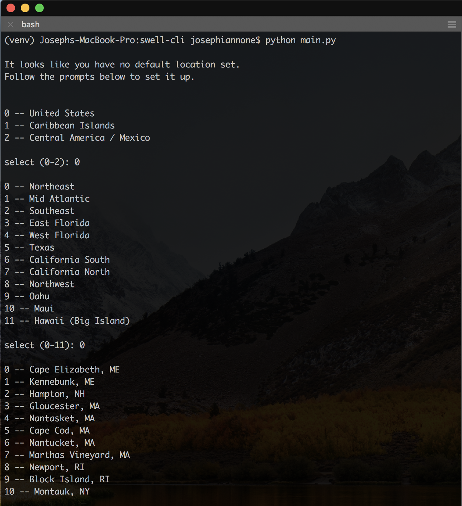
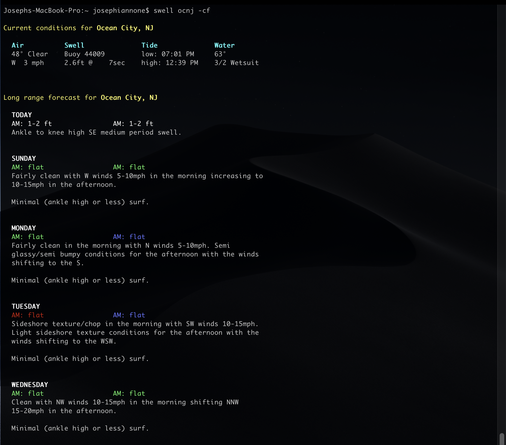

# swellCLI :ocean::surfer:

### ATTENTION: Following documentation is no longer accurate - the swellinfo.com website was recently updated (drastically) so this tool is under development to adapt to the changes.

## A command line interface for checking the surf!

An ongoing project. I plan to continue working on this with the hopes of continously increasing the robustness and reliability of the data acquisition. But otherwise just a fun program for the time being and pretty convenient for anyone who happens to be a developer and a surfer.

### Requires:
- python 3.6+

### Setup:
(*virtualenv is recommended*)
```
$ virtualenv -p python3.6 venv
$ source venv/bin/activate
$ pip install -r requirements.txt
```
### Run with:
```
$ python main.py [args]
```

### CLI:
- **no args**    -- Returns current conditions for your default location
- **add**        -- Prompts to add a location to 'favorite spots' that can be referenced later with a nickname
- **spots**      -- Returns your current settings (default location, favorites)
- **[nickname]** -- Returns current conditions for the given nickname
- **-f**         -- Returns extended forecast (can also be used as [nickname] -f )

### Data:
- Scraped from swellinfo.com

### Screenshots:




