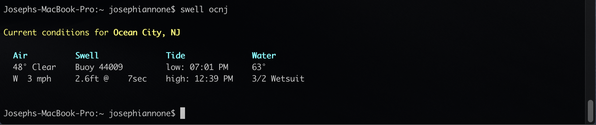
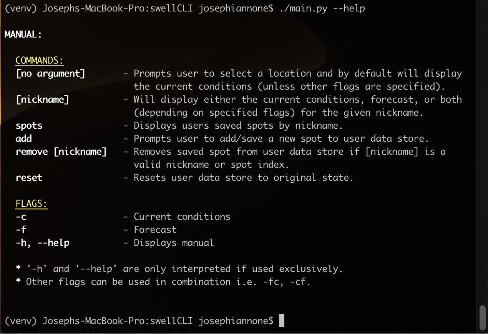

# swellCLI :ocean::surfer:

## A command line interface for checking the surf!


### System Requirement:
- python 3.4+

---

### Install (macOS):
**With** virtualenv (_recommended_)
```
:~/swellCLI $ virtualenv -p python3 venv
:~/swellCLI $ source venv/bin/activate
(venv) :~/swellCLI $ ./install.py
```

---

### Usage:
```
$ swell [args]
```

---

### COMMANDS:
-  **[no argument]**        -- Prompts user to select a location and by default will display the current conditions (unless other flags are specified).
-  **[nickname]**           -- Will display either the current conditions, forecast, or both (depending on specified flags) for the given nickname.
-  **spots**                -- Displays users saved spots by nickname.
-  **add**                  -- Prompts user to add/save a new spot to user data store.
-  **remove [nickname]**    -- Removes saved spot from user data store if it is a valid nickname or spot index.
-  **reset**                -- Resets user data store to original state.

### FLAGS:
-  **-c**                    -- Current conditions
-  **-f**                    -- Forecast
-  **-h**, **--help**        -- Displays manual


_'-h' and '--help' are only interpreted if used exclusively._
_Other flags can be used in combination i.e. -fc, -cf._

---

### Data:
- Scraped from swellinfo.com

---

### Screenshots:




